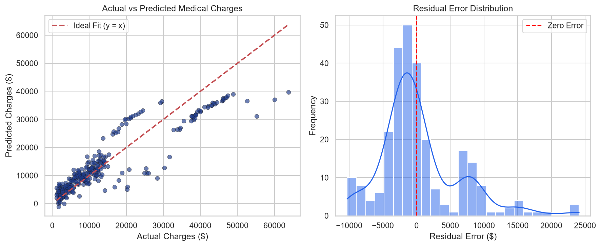
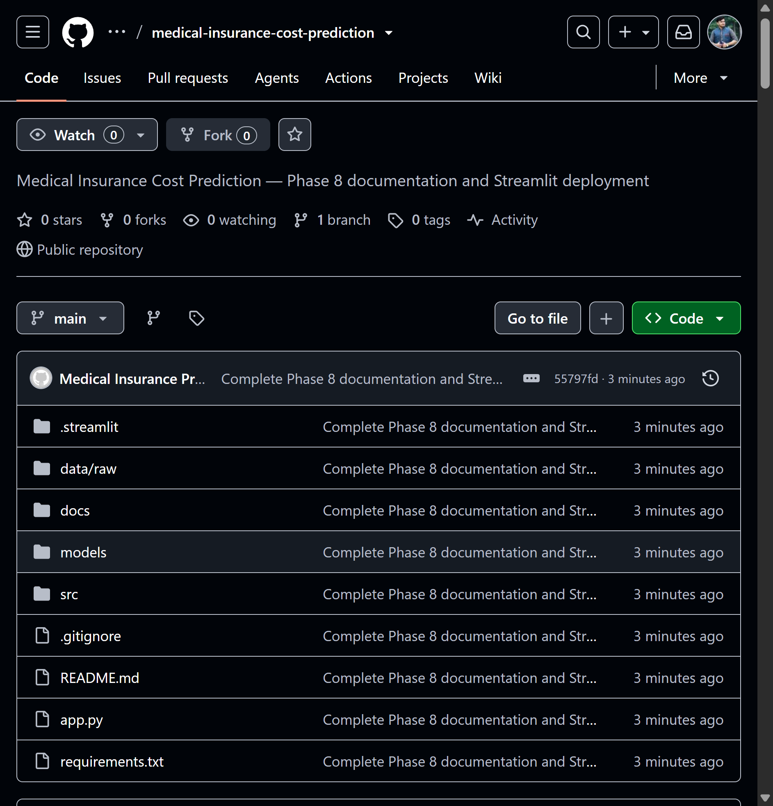
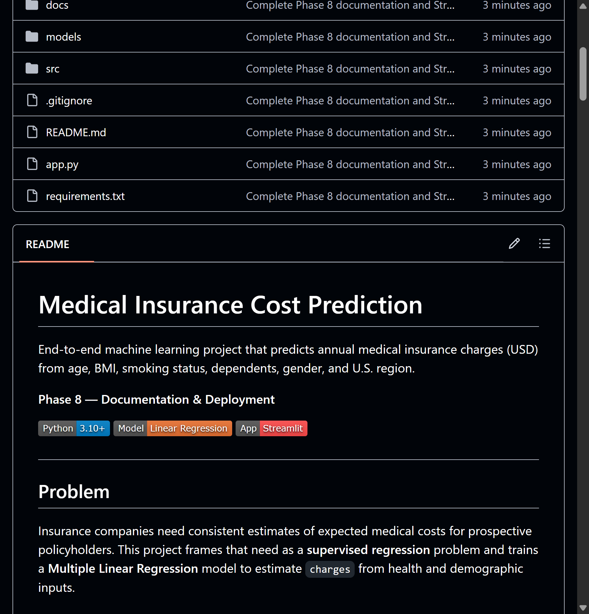
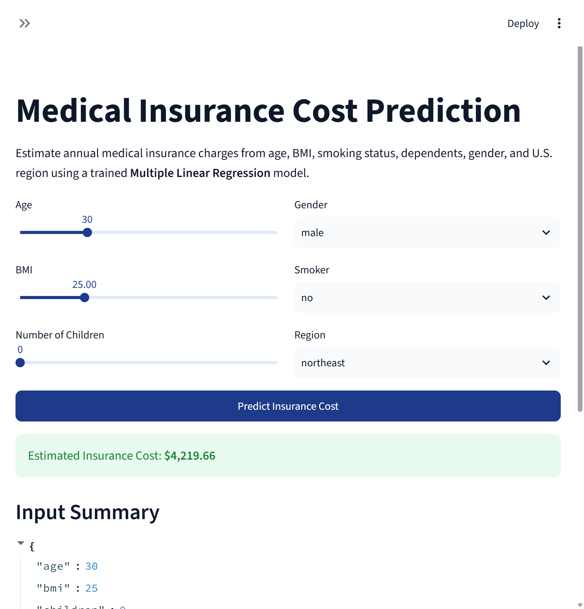
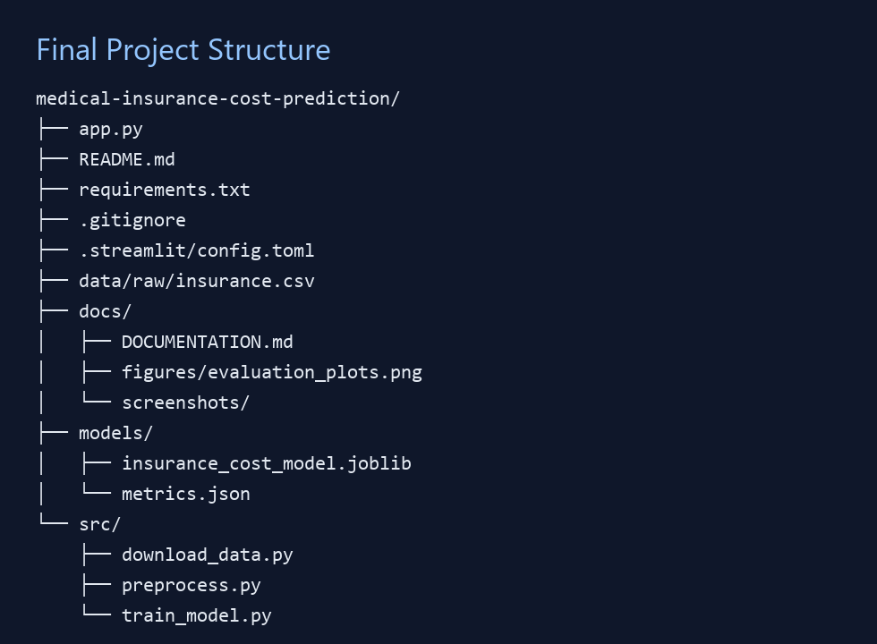

# Medical Insurance Cost Prediction

End-to-end machine learning project that predicts annual medical insurance charges (USD) from age, BMI, smoking status, dependents, gender, and U.S. region.

**Phase 8 — Documentation & Deployment**

[](https://www.python.org/)
[](https://scikit-learn.org/)
[](https://streamlit.io/)

---

## Problem

Insurance companies need consistent estimates of expected medical costs for prospective policyholders. This project frames that need as a **supervised regression** problem and trains a **Multiple Linear Regression** model to estimate `charges` from health and demographic inputs.

**Use cases**
- Personalized premium estimation support
- Transparent risk-factor analysis (especially smoking)
- Faster underwriting prototypes

---

## Dataset

| Item | Detail |
|---|---|
| Source | [Kaggle Medical Cost Personal Dataset](https://www.kaggle.com/datasets/mirichoi0218/insurance) (`mirichoi0218/insurance`) |
| Raw size | 1,338 rows × 7 columns |
| Clean size | 1,337 rows (1 duplicate removed) |
| Missing values | 0 |
| Target | `charges` (continuous USD) |

**Features:** `age`, `sex`, `bmi`, `children`, `smoker`, `region`

### Exploratory findings
- Charges are right-skewed (mean ≈ $13,270; median ≈ $9,382)
- Smokers (~20.5%) have substantially higher costs than non-smokers
- Age and BMI generally increase predicted charges
- Smoking is the strongest practical cost driver

---

## Preprocessing

1. Drop 1 duplicate row → **1,337** samples  
2. Binary encode `sex` (`female=0`, `male=1`) and `smoker` (`no=0`, `yes=1`)  
3. One-hot encode `region` with `drop_first=True` (northeast baseline)  
4. Final predictors:

```text
age, sex, bmi, children, smoker,
region_northwest, region_southeast, region_southwest
```

---

## Model & Training

| Setting | Value |
|---|---|
| Algorithm | Multiple Linear Regression (`sklearn`) |
| Split | 80% train / 20% test |
| Random seed | `42` |
| Train rows | 1,069 |
| Test rows | 268 |

```bash
python src/download_data.py
python src/train_model.py
```

Artifacts written to:
- `models/insurance_cost_model.joblib`
- `models/metrics.json`
- `docs/figures/evaluation_plots.png`

---

## Evaluation Results

| Metric | Result |
|---|---|
| Training R² | **0.7299 (72.99%)** |
| Testing R² | **0.8069 (80.69%)** |
| MAE | **$4,177.05** |
| RMSE | **$5,956.34** |

### Key coefficient insights
- **Smoker ≈ +$23,078** → dominant driver of predicted cost  
- Age ≈ +$248 / year  
- BMI ≈ +$319 / unit  
- Children ≈ +$533 / dependent  



---

## Prediction Application

### Run locally

```bash
pip install -r requirements.txt
python src/train_model.py
streamlit run app.py
```

Open the local Streamlit URL (usually `http://localhost:8501`).

### Example predictions

| Profile | Age | BMI | Children | Smoker | Region | Predicted cost |
|---|---|---|---|---|---|---|
| Low risk | 30 | 25.0 | 0 | no | southeast | **$3,380.74** |
| High risk | 45 | 32.0 | 2 | yes | northwest | **$33,925.76** |

---

## Project Structure

```text
medical-insurance-cost-prediction/
├── app.py                      # Streamlit prediction app
├── requirements.txt
├── README.md
├── data/
│   └── raw/
│       └── insurance.csv       # downloaded dataset
├── docs/
│   ├── DOCUMENTATION.md        # full workflow write-up
│   ├── figures/
│   │   └── evaluation_plots.png
│   └── screenshots/            # GitHub / app proof screenshots
├── models/
│   ├── insurance_cost_model.joblib
│   └── metrics.json
└── src/
    ├── download_data.py
    ├── preprocess.py
    └── train_model.py
```

---

## Screenshots

### GitHub repository


### README on GitHub


### Deployed application


### Working prediction


### Final project structure


| Required proof | File |
|---|---|
| GitHub repository | `docs/screenshots/01_github_repo.png` |
| README on GitHub | `docs/screenshots/02_readme.png` |
| Deployed application | `docs/screenshots/03_deployed_app.png` |
| Working prediction | `docs/screenshots/04_working_prediction.png` |
| Final project structure | `docs/screenshots/05_project_structure.png` |

**GitHub repository:** https://github.com/MUHAMMADSAFIULLAH6747/medical-insurance-cost-prediction  

**Live app (local):** `http://localhost:8501`  
**Live app (cloud):** _deploy via [Streamlit Community Cloud](https://share.streamlit.io/deploy?repository=MUHAMMADSAFIULLAH6747%2Fmedical-insurance-cost-prediction&branch=main&mainModule=app.py) and paste the `.streamlit.app` URL here_

---

## Limitations

1. Linear model may miss non-linear interactions (e.g., smoker × high BMI).  
2. Dataset is relatively small and U.S.-region based.  
3. No clinical history / prior claims features.  
4. Larger errors possible for extreme high-cost cases.  
5. Educational prototype — not a production actuarial pricing engine.

---

## Reproducibility

Another person can reproduce this project by:

1. Cloning this repository  
2. Installing `requirements.txt`  
3. Running `python src/train_model.py` (downloads data if needed)  
4. Launching `streamlit run app.py`  

Full narrative documentation: [`docs/DOCUMENTATION.md`](docs/DOCUMENTATION.md)

---

## License & Credits

- Dataset credit: Brett Lantz / Kaggle (`mirichoi0218/insurance`)  
- Built for academic Phase 8: Documentation & Deployment
